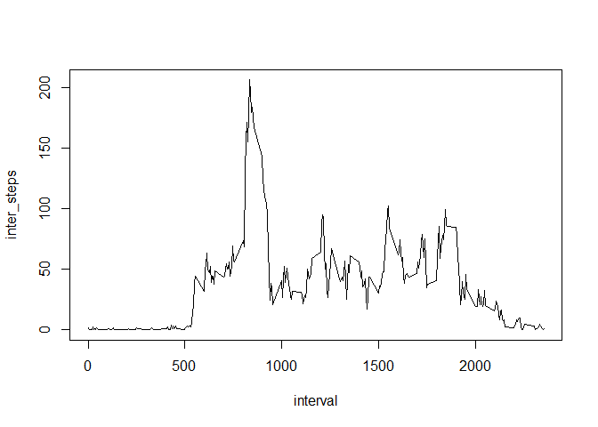

# Reproducible Research: Peer Assessment 1


## Loading and preprocessing the data

Set the working directory to where the data is and then read the data.
Load already the dplyr package and change the field date from a character vector to actual dates.


```r
setwd("C:/oppimateriaali/coursera/ds/reproducible_research/RepData_PeerAssessment1")
activity <- read.csv(unz(description ="activity.zip",filename ="activity.csv" ),stringsAsFactors=FALSE)
library(dplyr,warn.conflicts = FALSE)
activity$date <- as.Date(activity$date)
```


## What is mean total number of steps taken per day?

Calculate the mean number of steps per day, excluding the intervals from which there were no measurements.
The days for which there are no measurement values are also excluded.

```r
day_level <- activity %>% 
    group_by(date) %>%  
    summarize(day_steps = sum(steps,na.rm=TRUE),valid_times=sum(!is.na(steps))) %>% 
    filter(valid_times>0)
hist(day_level$day_steps)
```

<!-- -->

```r
meanSteps <- round(mean(day_level$day_steps),0)
medianSteps <- median(day_level$day_steps)
```
The median number of steps per day is *10765*  
The mean number of steps per day is *1.0766\times 10^{4}*

## What is the average daily activity pattern?

The daily activity pattern as the average step count for each 5-minute interval calculated over
all the available days. Missing observations are excluded.

```r
interval_level <- activity %>% 
    group_by(interval) %>% 
    filter(!is.na(steps)) %>% 
    summarize(inter_steps = mean(steps))
with(interval_level, plot(interval,inter_steps, type="l"))
```

<!-- -->

```r
max_interval <- with(interval_level, interval[which.max(inter_steps)])
```
The interval with the maximum average step count is 835

## Imputing missing values

There are missing values in the data, which have been thusfar simply excluded.  
Now we will use the strong autocorrelation of the data and as the imputed value for each
missing value we will use the latest observed value.
Since the first value might also be missing we will set that to the average value for that interval, 
which was calculated previously.


```r
# New dataset
activity_new<- activity
autocorrelation <- acf(activity_new$steps[!is.na(activity_new$steps)],lag=1,plot=FALSE)$acf[2,1,1]
NA_count <- sum(is.na(activity_new$steps))

# Imputation
if(is.na(activity_new$steps[1])){
    activity_new$steps[1] <- interval_level$inter_steps[interval_level$interval==activity_new$interval[1]]
} 
for(row in 2:nrow(activity_new)){
    if(is.na(activity_new$steps[row])) activity_new$steps[row] <- activity_new$steps[(row-1)]
}

# Calculate again day_level
day_level2 <- activity_new %>% 
    group_by(date) %>%  
    summarize(day_steps = sum(steps,na.rm=TRUE),valid_times=sum(!is.na(steps))) %>% 
    filter(valid_times>0)
hist(day_level2$day_steps)
```

<!-- -->

```r
meanSteps2 <- round(mean(day_level2$day_steps),0)
medianSteps2 <- median(day_level2$day_steps)
difMean <- meanSteps - meanSteps2
difMedian <- medianSteps - medianSteps2
```
The autocorrelation with lag = 1 the was 0.7965587  
So the taken direction seems reasonable in that sense.  
The histogram for the step counts per day seems similar to the original histogram.  
The mean step count with the imputed dataset is 9362 and the difference to the 
original is 1404 .  
The median step count with the imputed dataset is 1.0395\times 10^{4} and the difference to the 
original is 370 .  
It seems that the chosen imputation method was for the most part decent enough (although multiple imputation is always the actually correct solution).


```r
# There seems to be a few times of prolonged periods of missing values
plot(is.na(activity$steps),type="l",main="Missingness over time")
```

<!-- -->

```r
# The imputed values seem to fall quite nicely in the data
par(mfrow=c(2,1))
plot.ts(activity_new$steps,main="New steps")
plot.ts(activity$steps,main="original steps")
```

<!-- -->
  
The data and missingness structure makes one wonder if the longer periods of missingness are actually e.g. sleeping, and thus imputing zero steps for those intervals would be even more justified.

## Are there differences in activity patterns between weekdays and weekends?

The activity pattern seems to be very different between weekends and weekdays.


```r
activity_new$weekend <- as.POSIXlt(activity_new$date)$wday
activity_new$weekend <- activity_new$weekend %in% c(0,6)
activity_new$weekend <- as.factor(activity_new$weekend)
weekend <- activity_new %>% 
    group_by(weekend,interval) %>% 
    summarize(mean_steps = mean(steps))
par(mfrow=c(2,1))
plot.ts(weekend$mean_steps[weekend$weekend=="TRUE"],main="Weekend",ylab="Stepcount")
plot.ts(weekend$mean_steps[weekend$weekend=="FALSE"],main="Weekdays",ylab="Stepcount")
```

<!-- -->
